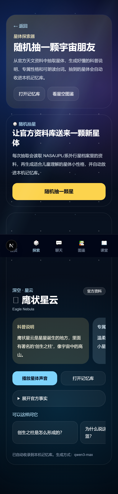
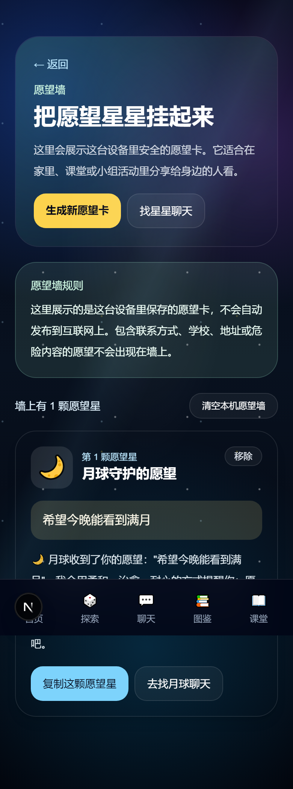

# Stars Saying / 假设星星会说话

移动优先的儿童天文学习 Web App。孩子可以随机抽取宇宙朋友、和拟人化星体聊天、查看知识卡片、进入星空课堂，并生成星空愿望卡。

在线演示：https://stars-saying.vercel.app

## 截图

<details>
<summary>📱 查看界面截图</summary>

| 首页 | 随机抽星 |
|------|----------|
|  |  |

| 星体聊天 | 星空图鉴 |
|----------|----------|
|  |  |

| 星空课堂 | 愿望卡 |
|----------|--------|
|  |  |

| 愿望墙 |
|--------|
|  |

</details>

## 主要能力

- **拟人化星体聊天**：太阳、月球、行星、恒星、星座、深空天体和系外行星，大模型驱动儿童友好回复。
- **随机抽星**：服务端调用 NASA 官方天文数据，KAFU/OpenAI 大模型生成儿童可读的科普说明和星体性格。
- **本机记忆库**：抽到的星体保存在浏览器本地，支持横向滑动浏览、语音播放和自由提问。
- **语音体验**：浏览器语音输入、温柔中文女声朗读、可打断播放。
- **星空图鉴**：可搜索的知识卡片库，热门关键词一键检索，语义联想匹配。
- **星空课堂**：短课程模块，本地记录已学/未学状态，支持反向修改。
- **愿望卡**：选择星体、写下安全愿望，生成可截图保存的星空愿望卡。
- **愿望墙**：本机保存的愿望卡片展示，自动过滤个人信息和危险内容。
- **底部导航**：首页、探索、聊天、图鉴、课堂五个入口一键切换。
- **儿童安全边界**：个人信息、危险内容和不适合儿童的话题会被拦截或温柔引导。

## 技术栈

- Next.js 15 App Router
- TypeScript + Tailwind CSS
- Vercel AI SDK / OpenAI-compatible provider
- 阿里云 DashScope（KAFU）/ OpenAI 大模型
- 服务端 NASA API 官方天文数据适配
- 本地优先探索记忆库（localStorage）

## 快速开始

```bash
npm install
cp .env.example .env
npm run dev
```

打开 `http://localhost:3000`。

没有模型密钥时，应用使用本地兜底内容运行。配置 `.env` 中 `KAFU_LLM_API_KEY` 或 `OPENAI_API_KEY` 即可启用大模型。

## 环境变量

| 变量 | 说明 |
|------|------|
| `KAFU_LLM_API_KEY` | 阿里云 DashScope API Key |
| `KAFU_LLM_BASE_URL` | DashScope 兼容端点 |
| `KAFU_CHAT_MODEL` | 聊天模型（默认 `qwen3-max`） |
| `OPENAI_API_KEY` | OpenAI 兼容兜底 Key |
| `NASA_API_KEY` | NASA API Key（可选，未配置时用 DEMO_KEY） |
| `SETTINGS_PASSWORD` | `/admin` 管理后台密码 |

## 项目结构

```
src/
├── app/            # 路由、页面、API routes
├── components/     # 儿童交互组件
├── data/           # 星体、知识卡片、课堂内容
├── lib/            # 聊天、检索、语音、天文 API 适配
└── types/          # 共享类型定义
docs/               # 部署与安全文档
ui-screenshots/     # 界面截图
```

## 路由

**儿童主流程：**

| 路由 | 页面 |
|------|------|
| `/` | 首页 |
| `/explore` | 随机星体探索 |
| `/chat` `/chat/[id]` | 星体选择与聊天 |
| `/memory` `/memory/[id]/chat` | 本机记忆库 |
| `/library` `/knowledge/[id]` | 星空图鉴与知识卡片 |
| `/classroom` `/classroom/[id]` | 星空课堂 |
| `/wish` | 星空愿望卡 |
| `/wish-wall` | 愿望墙 |

**内部页面（密码保护，不出现在儿童导航）：**

| 路由 | 页面 |
|------|------|
| `/admin` | 管理后台与配置状态 |
| `/account` `/dashboard` `/studio` `/lab` `/exhibition` `/intro` | 内部扩展 |

## 儿童安全

- 儿童主流程不需要账户。
- 愿望、记忆和聊天记录保存在当前设备浏览器里。
- 愿望墙拦截危险内容和个人信息（电话、地址、学校、邮箱等）。
- 聊天范围保持在天文学习、观测引导和温柔鼓励内。
- 成人/内部页面通过 `/admin` 密码保护。

## 部署

推荐 Vercel，详见 [部署说明](./docs/DEPLOYMENT.md)。

## 文档

- [部署说明](./docs/DEPLOYMENT.md)
- [儿童安全与隐私](./docs/SAFETY.md)
- [产品策略](./.codex/CHILD_APP_STRATEGY.md)